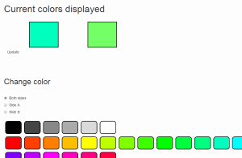

# blink1-web

Node-hosted web interface for blink1 that uses node-blink1 and node-hid to communicate with the device.

* 
* 
* 

## Prerequisites

* python 2.7.3 - if you have later versions of python you may have to do tricksy things with your path variable
* npm, nodejs - some effort may be required to fix npm, see separate section

## Installation

Clone this repo

    git clone https://github.com/Zazcallabah/blink1-web.git
    cd blink1-web
    npm install

The npm install may need sudo. If it fails, try installing node-hid globally.

    node server.js
    http://localhost:19333

## Depends on

* http://raphaeljs.com/picker/
* https://github.com/todbot/blink1
* https://nodejs.org/
* https://github.com/sandeepmistry/node-blink1
* https://github.com/node-hid/node-hid

## Todo

* Interface for getting, setting, and playing sequences.
* Buttons for specific states. Maybe programmable? Ideas from the blinkcontrol program.
* Support multiple blink1 devices
* Support different firmwares?
* enter command from url
* make real npm module
* error handle and resume if device is removed and readded

## Known issues

* Resizing the browser window may screw up the color pickers.

## npm install instructions

Install npm

    sudo apt-get install npm

Name conflict in package manager may mean you have to manually link the binary

    sudo ln -s /usr/bin/nodejs /usr/bin/node

install prereqs for getting node-hid to work on ubuntu

    sudo apt-get install libudev-dev libusb-1.0-0-dev

npm cant handle https apparently

    sudo npm config set registry http://registry.npmjs.org/
    npm config set registry http://registry.npmjs.org/

blink1 specific instructions

    wget https://raw.githubusercontent.com/todbot/blink1/master/linux/51-blink1.rules
    sudo cp 51-blink1.rules /etc/udev/rules.d/
    sudo udevadm control --reload-rules

reboot is needed to fix node version mismatch

    sudo shutdown -r now
    
After that just do `npm install` in this repo.

